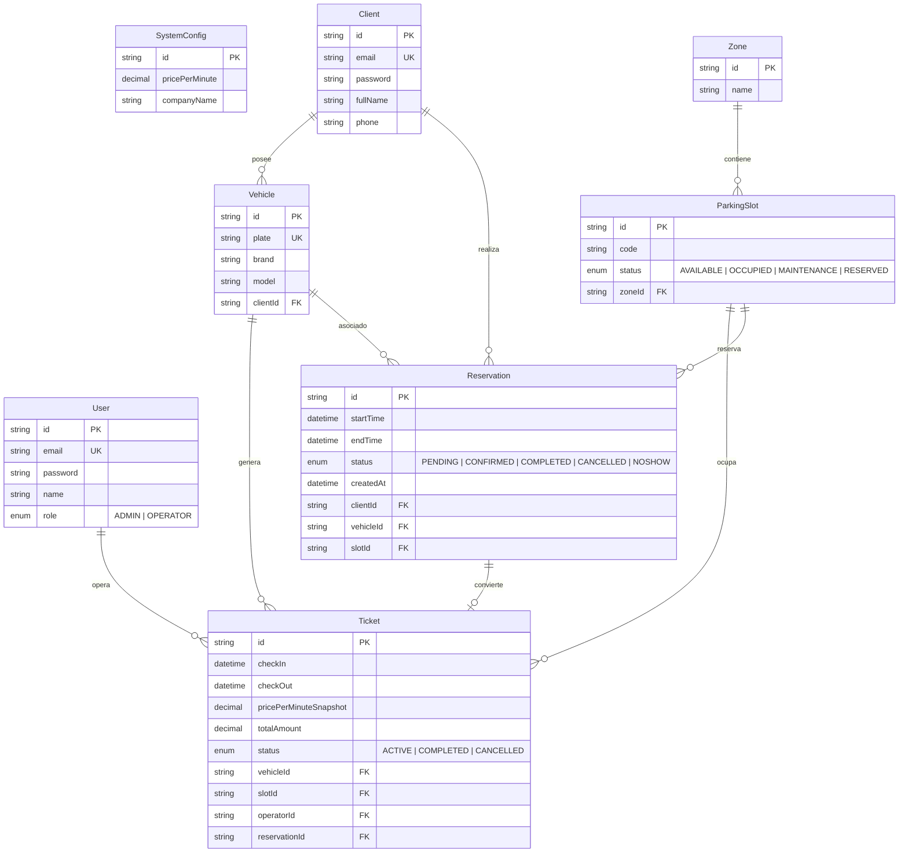
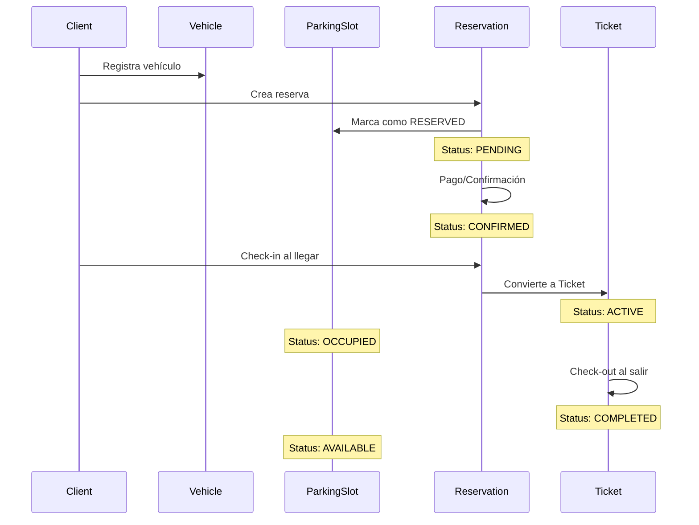
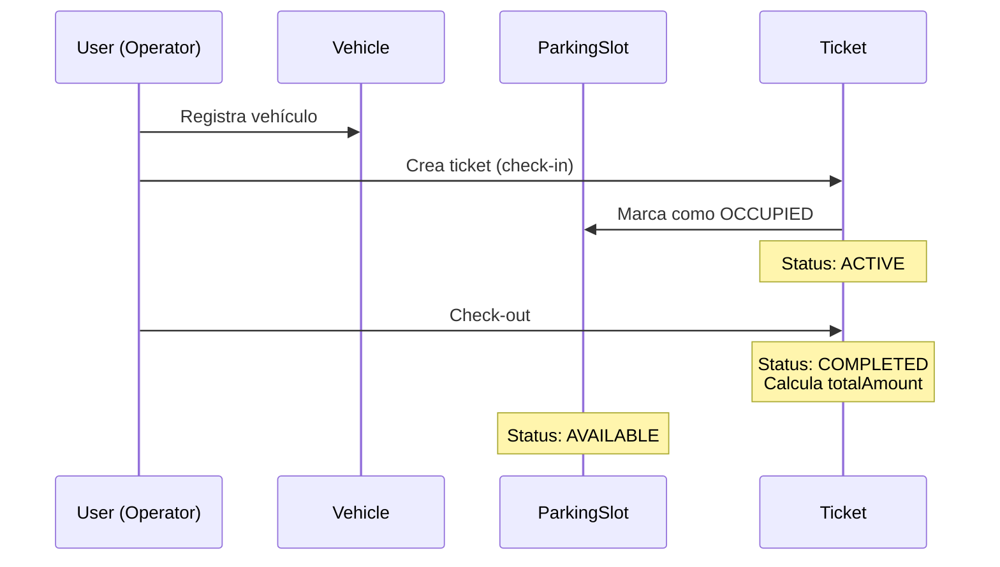

# Modelo Entidad-Relación - Sistema de Gestión de Estacionamiento

Este documento presenta el modelo de datos completo del sistema de gestión de estacionamiento, mostrando todas las entidades, sus atributos y las relaciones entre ellas.

---

## 📊 Diagrama Entidad-Relación



---

## 📚 Descripción de Entidades

### 1. SystemConfig (Configuración del Sistema)

**Descripción:** Almacena la configuración global del sistema de estacionamiento.

| Campo | Tipo | Descripción |
|-------|------|-------------|
| `id` | UUID (PK) | Identificador único |
| `pricePerMinute` | Decimal | Tarifa por minuto de estacionamiento |
| `companyName` | String (opcional) | Nombre de la empresa para tickets |

**Notas:**

- Solo debe existir un registro en esta tabla
- Valores por defecto: `pricePerMinute = 0.0`

---

### 2. User (Usuarios del Sistema / Staff)

**Descripción:** Personal del estacionamiento (administradores y operadores).

| Campo | Tipo | Descripción |
|-------|------|-------------|
| `id` | UUID (PK) | Identificador único |
| `email` | String (UK) | Email único para login |
| `password` | String | Contraseña hasheada (bcrypt) |
| `name` | String | Nombre completo del usuario |
| `role` | Enum | Rol: `ADMIN` o `OPERATOR` |

**Relaciones:**

- Un usuario puede operar múltiples tickets (1:N)

**Valores Enum - UserRole:**

- `ADMIN` - Administrador con acceso completo
- `OPERATOR` - Operador de guardia/cajero

---

### 3. Client (Clientes de la App Móvil)

**Descripción:** Usuarios finales de la aplicación móvil que reservan espacios.

| Campo | Tipo | Descripción |
|-------|------|-------------|
| `id` | UUID (PK) | Identificador único |
| `email` | String (UK) | Email único para login |
| `password` | String | Contraseña hasheada (bcrypt) |
| `fullName` | String | Nombre completo del cliente |
| `phone` | String (opcional) | Teléfono para notificaciones |

**Relaciones:**

- Un cliente puede tener múltiples vehículos (1:N)
- Un cliente puede realizar múltiples reservaciones (1:N)

---

### 4. Zone (Zonas de Estacionamiento)

**Descripción:** Zonas físicas o secciones del estacionamiento.

| Campo | Tipo | Descripción |
|-------|------|-------------|
| `id` | UUID (PK) | Identificador único |
| `name` | String | Nombre de la zona (ej: "Planta Baja", "Zona A") |

**Relaciones:**

- Una zona contiene múltiples espacios de estacionamiento (1:N)

**Ejemplo de datos:**

- "Planta Baja"
- "Zona A - Norte"
- "Nivel 2"

---

### 5. ParkingSlot (Espacios de Estacionamiento)

**Descripción:** Espacios individuales de estacionamiento dentro de una zona.

| Campo | Tipo | Descripción |
|-------|------|-------------|
| `id` | UUID (PK) | Identificador único |
| `code` | String | Código del espacio (ej: "A-01") |
| `status` | Enum | Estado actual del espacio |
| `zoneId` | UUID (FK) | Referencia a la zona |

**Relaciones:**

- Pertenece a una zona (N:1)
- Puede tener múltiples tickets históricos (1:N)
- Puede tener múltiples reservaciones (1:N)

**Restricciones:**

- `(zoneId, code)` debe ser único (no duplicados en la misma zona)

**Valores Enum - SlotStatus:**

- `AVAILABLE` - Disponible para uso
- `OCCUPIED` - Ocupado actualmente
- `MAINTENANCE` - En mantenimiento
- `RESERVED` - Reservado por un cliente

---

### 6. Vehicle (Vehículos)

**Descripción:** Vehículos registrados en el sistema.

| Campo | Tipo | Descripción |
|-------|------|-------------|
| `id` | UUID (PK) | Identificador único |
| `plate` | String (UK) | Patente única del vehículo |
| `brand` | String (opcional) | Marca del vehículo |
| `model` | String (opcional) | Modelo del vehículo |
| `clientId` | UUID (FK, opcional) | Cliente propietario (si usa app) |

**Relaciones:**

- Puede pertenecer a un cliente (N:1, opcional)
- Puede generar múltiples tickets (1:N)
- Puede tener múltiples reservaciones (1:N)

**Notas:**

- Los vehículos sin `clientId` son de clientes walk-in (sin app)

---

### 7. Reservation (Reservaciones)

**Descripción:** Reservas futuras de espacios de estacionamiento realizadas por clientes.

| Campo | Tipo | Descripción |
|-------|------|-------------|
| `id` | UUID (PK) | Identificador único |
| `startTime` | DateTime | Fecha/hora de inicio de la reserva |
| `endTime` | DateTime | Fecha/hora estimada de fin |
| `status` | Enum | Estado de la reservación |
| `createdAt` | DateTime | Fecha de creación de la reserva |
| `clientId` | UUID (FK) | Cliente que realizó la reserva |
| `vehicleId` | UUID (FK) | Vehículo asociado |
| `slotId` | UUID (FK) | Espacio reservado |

**Relaciones:**

- Pertenece a un cliente (N:1)
- Asociado a un vehículo (N:1)
- Asociado a un espacio de estacionamiento (N:1)
- Puede convertirse en un ticket al hacer check-in (1:1, opcional)

**Índices:**

- `(startTime, endTime)` - Para búsquedas rápidas de disponibilidad

**Valores Enum - ReservationStatus:**

- `PENDING` - Creada, esperando confirmación/pago
- `CONFIRMED` - Pagada y confirmada
- `COMPLETED` - Cliente llegó y se convirtió en ticket
- `CANCELLED` - Usuario canceló la reserva
- `NOSHOW` - Cliente nunca llegó

---

### 8. Ticket (Tickets de Estacionamiento)

**Descripción:** Registro de entrada y salida de vehículos en el estacionamiento.

| Campo | Tipo | Descripción |
|-------|------|-------------|
| `id` | UUID (PK) | Identificador único |
| `checkIn` | DateTime | Fecha/hora de entrada |
| `checkOut` | DateTime (opcional) | Fecha/hora de salida |
| `pricePerMinuteSnapshot` | Decimal | Tarifa aplicada al momento del check-in |
| `totalAmount` | Decimal (opcional) | Monto total a pagar |
| `status` | Enum | Estado del ticket |
| `vehicleId` | UUID (FK) | Vehículo asociado |
| `slotId` | UUID (FK) | Espacio utilizado |
| `operatorId` | UUID (FK, opcional) | Operador que registró |
| `reservationId` | UUID (FK, UK, opcional) | Reserva original si aplica |

**Relaciones:**

- Asociado a un vehículo (N:1)
- Asociado a un espacio de estacionamiento (N:1)
- Operado por un usuario (N:1, opcional)
- Puede originarse de una reserva (1:1, opcional)

**Índices:**

- `checkIn` - Para búsquedas por fecha
- `status` - Para filtrar por estado

**Valores Enum - TicketStatus:**

- `ACTIVE` - Vehículo actualmente dentro
- `COMPLETED` - Vehículo salió y pagó
- `CANCELLED` - Ticket anulado

**Notas:**

- `checkOut` y `totalAmount` son `null` hasta que el vehículo sale
- `pricePerMinuteSnapshot` guarda la tarifa histórica (por si cambia después)

---

## 🔄 Flujos de Negocio

### Flujo 1: Reserva con App Móvil



### Flujo 2: Cliente Walk-in (Sin Reserva)



---

## 📋 Restricciones y Reglas de Negocio

### Restricciones de Unicidad

| Tabla | Campos Únicos | Descripción |
|-------|---------------|-------------|
| `User` | `email` | Email único por usuario |
| `Client` | `email` | Email único por cliente |
| `Vehicle` | `plate` | Patente única |
| `ParkingSlot` | `(zoneId, code)` | Código único por zona |
| `Ticket` | `reservationId` | Una reserva genera máximo un ticket |

### Reglas de Validación

1. **Reservaciones:**
   - `endTime` debe ser posterior a `startTime`
   - No puede haber traslape de horarios para el mismo espacio
   - Un espacio reservado cambia a `status: RESERVED`

2. **Tickets:**
   - Al crear un ticket, se guarda `pricePerMinuteSnapshot` de `SystemConfig`
   - `checkOut` debe ser posterior a `checkIn`
   - `totalAmount` se calcula: `(checkOut - checkIn) en minutos × pricePerMinuteSnapshot`

3. **Espacios de Estacionamiento:**
   - Un espacio `OCCUPIED` no puede ser reservado ni asignado
   - Un espacio `MAINTENANCE` no está disponible
   - Un espacio `RESERVED` solo puede ser usado por quien lo reservó

### Índices para Performance

- `Ticket`: índices en `checkIn` y `status` para reportes y búsquedas
- `Reservation`: índice compuesto en `(startTime, endTime)` para validar disponibilidad
- Campos únicos tienen índices automáticos

---

## 🗂️ Enumeraciones (Enums)

### UserRole

```typescript
enum UserRole {
  ADMIN      // Acceso completo al sistema
  OPERATOR   // Operador de guardia/cajero
}
```

### SlotStatus

```typescript
enum SlotStatus {
  AVAILABLE    // Disponible para uso
  OCCUPIED     // Actualmente ocupado
  MAINTENANCE  // En mantenimiento
  RESERVED     // Reservado por un cliente
}
```

### ReservationStatus

```typescript
enum ReservationStatus {
  PENDING     // Creada, esperando confirmación
  CONFIRMED   // Pagada y confirmada
  COMPLETED   // Convertida en ticket
  CANCELLED   // Cancelada por el usuario
  NOSHOW      // Cliente no se presentó
}
```

### TicketStatus

```typescript
enum TicketStatus {
  ACTIVE      // Vehículo dentro del estacionamiento
  COMPLETED   // Vehículo salió y pagó
  CANCELLED   // Ticket anulado
}
```

---

## 🔗 Cardinalidades de Relaciones

| Relación | Cardinalidad | Descripción |
|----------|--------------|-------------|
| Zone → ParkingSlot | 1:N | Una zona tiene muchos espacios |
| Client → Vehicle | 1:N | Un cliente puede tener varios vehículos |
| Client → Reservation | 1:N | Un cliente puede hacer varias reservas |
| Vehicle → Ticket | 1:N | Un vehículo puede generar varios tickets |
| Vehicle → Reservation | 1:N | Un vehículo puede tener varias reservas |
| ParkingSlot → Ticket | 1:N | Un espacio puede tener varios tickets históricos |
| ParkingSlot → Reservation | 1:N | Un espacio puede ser reservado varias veces |
| User → Ticket | 1:N | Un operador registra varios tickets |
| Reservation → Ticket | 1:1 (opcional) | Una reserva genera máximo un ticket |

---

## 📝 Notas Técnicas

### Base de Datos

- **Motor:** PostgreSQL
- **ORM:** Prisma
- **Identificadores:** UUID v4
- **Timestamps:** DateTime con zona horaria

### Características Especiales

1. **Soft Delete:** No implementado. Las eliminaciones son físicas.
2. **Auditoría:** Solo `Reservation` tiene `createdAt`. Considerar agregar timestamps a otras tablas.
3. **Optimizaciones:**
   - Índices en campos de búsqueda frecuente
   - Restricciones únicas para integridad
   - Snapshot de precios en tickets para historial

### Extensibilidad Futura

- **Pagos:** Agregar tabla `Payment` vinculada a `Reservation` o `Ticket`
- **Notificaciones:** Tabla para registro de notificaciones enviadas
- **Promociones:** Sistema de descuentos y promociones
- **Reportes:** Vistas materializadas para KPIs

---

> [!TIP]
> Para más detalles de implementación, consulta el archivo [schema.prisma](file:///home/haleymhm/Projects/repositories-git/gestion-estacionamiento/backend/prisma/schema.prisma)

> [!NOTE]
> Este diagrama fue generado automáticamente a partir del esquema de Prisma. Fecha: 2026-01-26
